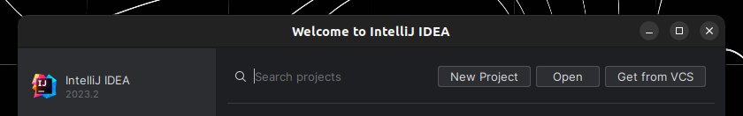
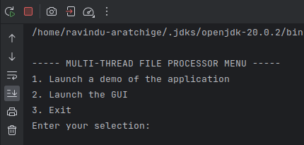
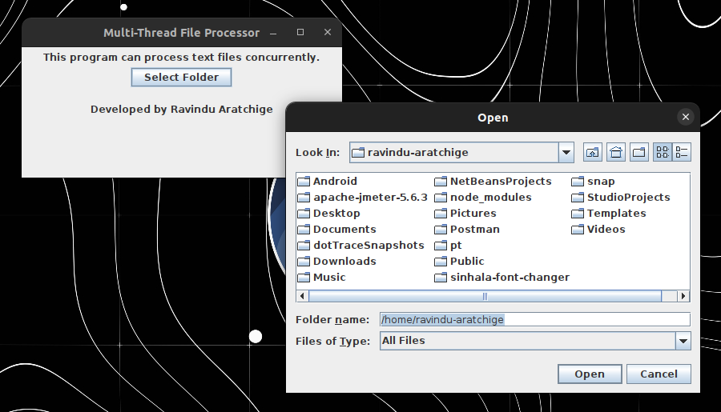

# Multi-Thread File Processor

This is a Java implementation of a multi-threaded application that can process text (`.txt` or `.TXT`) files in a directory.

This is my submission for the Assignment titled <b>Implement a Multi-threaded File Processor</b> of the <b>Software Modeling</b> (SE3022) module.

## Setup

You must have the JDK (Java Development Kit) installed on your system. It is recommended to have <b>JDK 21</b>, the latest version as of the writing of this README.

<b>NOTE</b>: if you are a Linux user, make sure that you install <a href="https://www.oracle.com/java/technologies/downloads/">Oracle's JDK</a> (not the <a href="https://openjdk.org/">OpenJDK</a>).

You must also have <a href="https://maven.apache.org/index.html">Maven</a> installed on your system.

You can check your installation using the following commands.

```shell
# check Java version
java -version

# check Maven version
mvn -version
```

This project uses <a href="https://www.jetbrains.com/idea/">JetBrain IntelliJ IDEA 2023.2</a> (or a newer version) as the IDE.

To setup this project locally on your machine, follow these steps:

### 1. Clone Project

Clone this project to a desired location on your system:

```shell
git clone https://github.com/ravi-aratchige/MultiThreadFileProcessor.git
```

### 2. Open Project in IDE

Open JetBrain IntelliJ IDEA and select `Open` from the menu:



Next, navigate to the project folder and open it.

### 3. Run Project

To run the application, select `Run` from the toolbar:


The text-based console menu will open up in the integrated terminal of your IDE:



### 4. Launch GUI

The GUI can be launched from the text-based console menu, or by separately running `FileProcessorGui.java`:



---

## Design Choices

The design of this project focused on simplicity, modularity, and user interaction. The use of a command-line interface (CLI) for the main menu allows users to interact with the application easily, providing clear options to choose from. The GUI was designed to be straightforward, with a clear purpose and a single button for user interaction.

Modularity was achieved by separating the GUI and file processing logic into separate classes, allowing for easier maintenance and future enhancements. Error handling was also considered, with the application providing informative messages to the user in case of invalid input or issues with file processing.

## Challenges Faced

1. Constructing a complete GUI in a limited timeframe, with minimal time to sketch the interface designs etc.
2. Ensuring that the threads are created, executed and finished appropriately and properly.
3. Streamlining communication between GUI logic and file processor logic using callback mechanisms and shared data.

## Improvements and Additional Features

As mentioned in the assignment specification, I would like to implement the ability to select which criteria must be processed (as checkboxes on the GUI), which I was unable to implement in the limited timeframe.

Additionally, the ability to display results in the GUI (instead of the CLI as done currently) is also a feature I would like to implement in the future.

---

Made with :heart: by Ravindu Aratchige